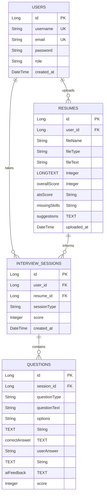

# AI Resume Analyzer & Interview Coach

An elegant, full-stack web application designed to help candidates optimize their resumes for Applicant Tracking Systems (ATS), detect skill gaps, and practice coding or behavioral mock interviews with real-time AI-guided critiques.

---

## 🚀 Key Features

### 1. User Module (Auth & Sessions)
* **Secure Authorization**: Stateless user authentication powered by **Spring Security** and cryptographically signed **JWT tokens**.
* **Credentials Hashing**: Password hashing using industry-standard **BCrypt**.
* **Profile Management**: Aggregated candidate metrics detailing upload history, mock sessions completed, and average scores.

### 2. Resume Analyzer Module
* **Multi-Format Extraction**: Parses text from `.pdf` and `.docx` files (utilizing Apache PDFBox and Apache POI).
* **ATS Compatibility Check**: Scores resumes (0–100) based on standard industry keyword matching and formatting rules.
* **Skill-Gap Detection**: Identifies and highlights recommended technical skills missing from the candidate's resume.
* **Actionable Recommendations**: Returns customized suggestions to boost formatting, phrasing, and metrics.

### 3. Mock Interview Coach Simulator
* **Tailored Context**: Mock interviews are automatically tailored to the candidate's uploaded resume skills.
* **Three Interview Tracks**:
  * **Java MCQs**: Multiple Choice Questions testing OOP, core Java features, and memory management.
  * **HR & Behavioral**: Situational questions following the STAR (Situation, Task, Action, Result) methodology.
  * **Coding Arena**: Practical coding challenges requiring candidates to write logical Java methods.
* **Real-time AI Grading**: Grade calculations (0-100%) and line-by-line constructive feedback generated by the **Gemini API**.

### 4. Controller & Admin Panel
* **Dynamic Analytics**: Premium CSS/SVG-rendered charts tracking score progression and recent mock sessions.
* **Administrative Controls**: Tabbed audits to review registered candidates, preview parsed resume texts, inspect interview logs, and promote/demote administrative security roles.

---

## 🛠️ Technology Stack

* **Frontend**: React.js, Vite, Vanilla CSS (Glassmorphism theme)
* **Backend**: Spring Boot 3.3.1, Maven
* **Security**: Spring Security + JJWT
* **Database**: H2 Database (In-Memory default for local runs) / MySQL (Production config ready)
* **ORM**: Spring Data JPA / Hibernate
* **AI Model**: Gemini API (`gemini-2.5-flash`)
* **File Parsers**: Apache POI (DOCX), Apache PDFBox (PDF)

---

## 📊 Database Schema



---

## 🏃 Getting Started

### Prerequisites
* Java JDK 21
* Node.js (LTS version 24+)
* Git

### Step 1: Clone and Configure Backend
1. Clone your repository.
2. Edit `backend/src/main/resources/application.properties` to add your **Gemini API Key**:
   ```properties
   gemini.api.key=YOUR_GEMINI_API_KEY
   ```
3. Run the Spring Boot application using the Maven wrapper:
   ```bash
   cd backend
   ./mvnw spring-boot:run
   ```
   *The backend starts on `http://localhost:8080` (with H2 database console accessible at `/h2-console`).*

### Step 2: Configure and Start Frontend
1. Navigate to the frontend directory:
   ```bash
   cd frontend
   npm install
   ```
2. Launch the Vite dev server:
   ```bash
   npm run dev
   ```
   *The client dashboard launches on `http://localhost:5173`.*

---

## 🔑 Pre-Configured Demo Credentials

For testing and demonstration, our E2E script pre-registers these profiles in the database:

### Candidate Account
* **Username**: `candidate`
* **Password**: `password`
* **Role**: USER (Candidate views, upload zone, mock QA dashboard)

### Admin Account
* **Username**: `admin`
* **Password**: `password`
* **Role**: ADMIN (Accesses the administrative control panel)
